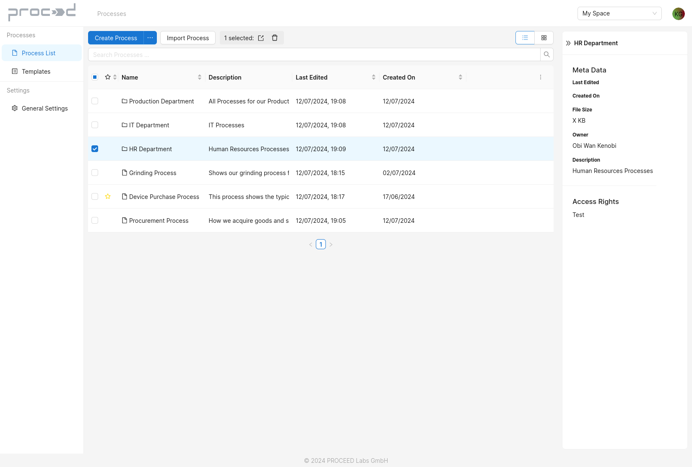
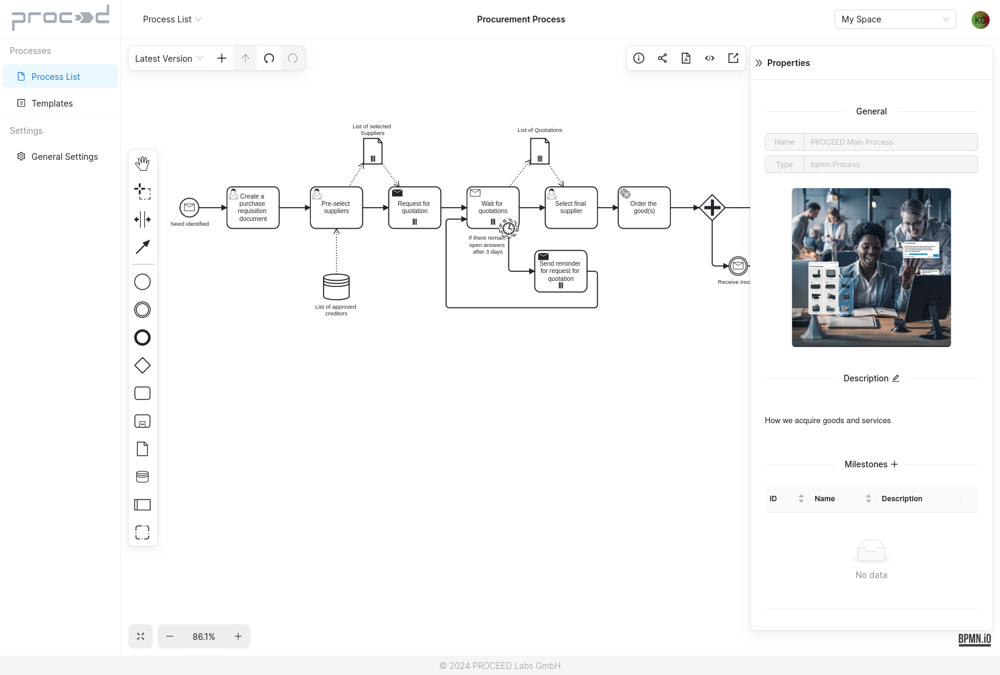
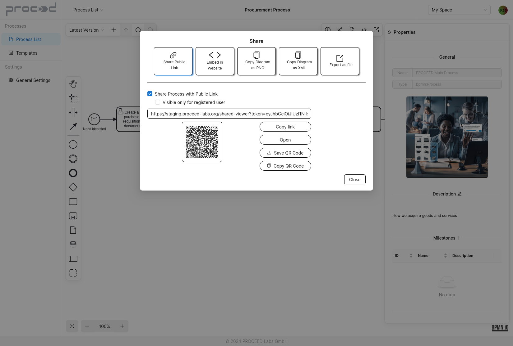
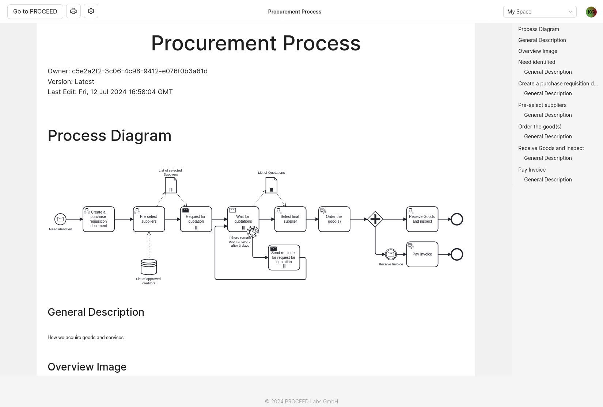

# PROCEED

[](https://github.com/PROCEED-Labs/proceed/actions/workflows/build_test_deploy.yml)

PROCEED is an open-source Business Process Management System (BPMS) specialized on the intelligent and user-friendly creation, execution and monitoring of processes.
Using built-in AI features and the industry-standard BPMN (Business Process Model and Notation), PROCEED's intuitive interface lets anyone visually design workflows, fosters collaboration and empowers employees to act autonomously.

PROCEED can also intelligently automate tasks, streamline approvals, and help to continuously optimize the operations. PROCEED enables the digitalization of companies and allows teams to focus on higher-value activities.

<p float="left">
     
    
     
    
     
</p>

> You can test the PROCEED BPMS on: https://app.proceed-labs.org  
> The documentation is available at: https://docs.proceed-labs.org  
> (The latest developments and some special features of PROCEED for specific application areas are not available in the publicly hosted version.)

The following explains how you can start the code of the open-source project PROCEED locally. Contributions, further developments or bug reports are very welcome. The best way to do this is to contact us directly or create a new issue. The development is coordinated by [PROCEED Labs GmbH.](https://www.proceed-labs.org/)

# Running the Source Code of PROCEED:

PROCEED mainly consists of two systems that have to be started separately:

1. the _Management System_ (MS): here you can create, manage, automate and monitor processes and business objects. The MS is a web application optimized for all major desktop and mobile browsers.
2. the _Process Engine_ (PE, or just Engine): this components receives process descriptions and executes them. The PE is available for many platforms and can easily be ported to missing architectures with our platform-independent framework.

**Install Code Execution Environment**

To run the latest code from this PROCEED repository, you only need to have `Node.js`, `Yarn` and `Docker` installed on your system. To know the recommended versions, please [check our wiki page](https://github.com/PROCEED-Labs/proceed/wiki/Installation-and-Configuration-for-Development). (There you will also find instructions for installing additional software recommendations if you want to extend PROCEED.)

After that, you must install the platform compiler `node-gyp` globally using Yarn:

`yarn global add node-gyp`

**Retrieving PROCEED's Dependencies**

After cloning/retrieving the code, you need to install the software dependencies. Run the following command in the root directory of the repo:

```
yarn install --ignore-engines
```

This will install all modules and their dependencies inside `node_modules/`

> Note: On macOS catalina there might be an error message popping up during the install step involving node-gyp. If it says "no xcode or clt version detected" then follow the steps from [this page of the node-gyp repo](https://github.com/nodejs/node-gyp/blob/master/macOS_Catalina.md) to resolve this problem.

### Starting the Development Code

You can start the development code by running the following commands

**Management System (with hot reloading):**

First, the following command starts a docker container with a Postgres DB and setups the default tables:

```
yarn dev-ms-db
```

Second, the next commands starts the Management System with hot reloading and connecting to the previously started database.

```
yarn dev-ms
```

Open the frontend at the following URL: http://localhost:3000/

**Engine:**

```
yarn dev
```

**Working with PROCEED's development version: Authentication & Authorization**

When you have started the development code of the Management System, the first interface is a login UI. You can either continue as _Guest_ with "Create a Process" or you can log in with a pre-configured development user by typing the username in the 'Continue with Development User' input field:

- `admin`
- `johndoe`

Both users actually have the same privileges by default, but the first one logging in can see the _System Dashboard_ and becomes the _System Admin_.

**Local Development with DB**

If you want to change the schema of the database for a new feature, you need to create a new database on a branch. For this, the most important command is:

```
yarn dev-ms-db-new-structure --name "new column name added"
```

For further explanations, see our [development wiki page](https://github.com/PROCEED-Labs/proceed/wiki/Contribution-Guidelines-for-Development#changing-the-database-schema-for-development).

# Contributions

If you are interested in developing PROCEED further, we are very open for help and project contributions. Regularly there are on-boarding development workshops and, if you are interested, we have weekly video calls with all developers.
The following options for contribution are mainly available:

- If you have ideas or find bugs, please create a new [Issue](https://github.com/PROCEED-Labs/proceed/issues).
- Extend the documentation with the help of pull requests for the [documentation repository.](https://github.com/PROCEED-Labs/docs)
- Write your own source code to fix bugs or extend the system. Please discuss the content additions in an issue beforehand or simply [contact us](mailto:dev@proceed-labs.org).

To help you understand the internal structure of PROCEED, we have prepared several [wiki entries](https://github.com/PROCEED-Labs/proceed/wiki).
For development you should start with looking at the [Hints for Installation and Configuration with our Preferred Dev Tools](https://github.com/PROCEED-Labs/proceed/wiki/Installation-and-Configuration-for-Development) and afterwards read the [Contribution Guide](https://github.com/PROCEED-Labs/proceed/wiki/Contribution).

For further information, just contact us: dev@proceed-labs.org
