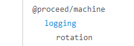

# How to start JSDoc

Use the following command in the root directory of the project

```
npx jsdoc -c jsdoc.config.json
```

Afterwards the generated HTML files are in `./jsdoc/output_html`. You can open the `index.html` to see the JSDoc documentation.

To configure JSDoc change the `jsdoc.config.json` file.

# Changes to the JSDOC default template

## Navigation sidebar

### Categories

The sidebar is divided into categories, if a category has been added by tag or <code>jsdoc.conf.json</code>.

### Add category by tag @category

Use the <code>@category categoryname</code> tag.

Example:

```
/**
 * @module @proceed/core
 * @category universal
 */
```

The module _@proceed/core_ will be under the _universal_ category in the sidebar.

### Add category based on file path

Use the <code>categoryByPath</code> option in <code>jsdoc.conf.json</code>.

Example:

```
"opts": {
    "categoryByPath": {
        "universal": "modules"
    },
```

The sidebar links for code in the _modules_ folder will be under the _universal_ part of the sidebar. The category is only assigned automatically if there isn't a @category tag already.

To add categories the <code>categories</code> plugin has to be added in <code>jsdoc.conf.json</code>

```
"plugins": [
    "./jsdoc_changes/template/plugins/categories.js"
```

### Missing category

If there are elements in the sidebar without a category they will be under the _root scope_ part, the last part in the sidebar (if non-categorized elements exist). The title can be changed in the <code>jsdoc.conf.json</code> options:

```
"opts": {
    "noCategoryTitle": "root scope",
```

### Module classes

Class links are appended to their modules in the sidebar. For it to work classes need to reference their modules with <code>@memberof module:modulename</code>

Example:

```
/**
 * @memberof module:@proceed/core
 */
class ProceedEngine {
  /**
   * constructor description
   */
```

### Global: default behavior

functions, members or constants that have a JSDOC comment and **are not inside a class and have no <code>@memberof</code> tag** will show up under _Global_ in the sidebar.

With <code>@memberof module:modulename</code> or <code>@memberof module:modulename.classname</code> the information can be moved to the module or class page so the link won't show up under Global anymore. For example if the Global link was a function, you will find it under Methods on the module page if you tagged it as member of the module.

### Move all Globals to their module page

To make all functions in a file(module) a member of that module, add a separate comment to the beginning of the file with <code>/\*_ @module name _/</code>. This will actually add all file content as a member to the module name.

### Show a module below another module in the navigation tree

The module has to be a member of the 'parent' module. The parent module can already be a member of another module. For example:

```
/**
* @module rotation
* @memberof module:@proceed/machine.module:logging
*/

```

will show in the navigation bar as


## Main

- JS-Types link to their MDN page (example: [String](https://developer.mozilla.org/en-US/docs/Web/JavaScript/Reference/Global_Objects/string))
- Link names of Module Classes only contain the Class name (example: 'Management' instead of 'module:@proceed/core.Management')

# required settings in <code>jsdoc.conf.json</code>

Path to the changed <code>publish.js</code>

```
"opts": {
    "template": "./jsdoc_changes/template"
```

Files to include (script and css)

```
"templates": {
        "default": {
            "layoutFile":"./jsdoc_changes/template/tmpl/mlayout.tmpl",
			"staticFiles":{
				"include": ["./jsdoc_changes/template/static/"]
			}
        },
        "css": ["styles/mstyle.css"]
```

## JSDOC workflow


